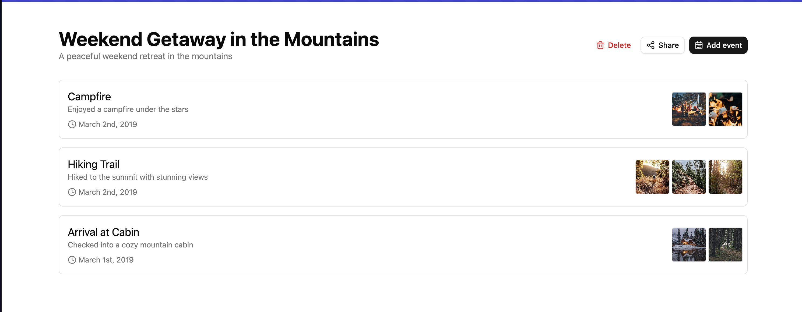
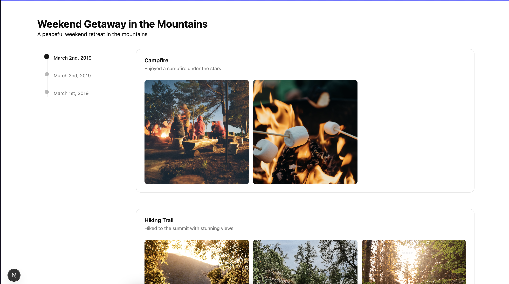

# Memory Lane

## Installation

### Run the install script

```sh
npm i --force
```

### Run frontend

```sh
npm run dev
```

### Run api

```sh
npm run serve:api
```

### Seed db with data

```sh
npm db:seed
```

## Get started

- Run backend api using `npm run serve:api`
- Seed the db with dummy data using `npm db:seed`
- Run frontend in another terminal using `npm run dev`
- Visit `http://localhost:3000` (3000 is the default port, it may vary)
- Login as `johndoe` and u can view all his memories and events
- To view the public urls just click on the share button in the card and it will have the link to view the public memory lane page

## Tech and Architecture

- Frontend - Nextjs
- Backend - Express
- Styling - Tailwindcss

Used NextJS to build the frontend. All routes in the web app are server rendered, all data fetching happens in the server using server components. Backend is written using ExpressJS. Its in javascript while i would have preferred using Typescript, I continued with JS as the there were already few apis already developed.

The web application has few administrative pages where users can manage their memories and associated events. Users can add new memories and link events to those memories. These routes are under `/~/<xxx>` path.

For the public-facing side, we have a "memory lane" view that users can share with family and friends. This view showcases the events and images related to a shared memory.

In the backend, we provide CRUD operations for memories and events. Since everything is hosted locally, user-uploaded files are saved in a static folder and served by the backend.

I’ve also updated the API to improve the routing structure, making it easier to manage additional routes in the future. One improvement I would make is switching to promise-based database calls instead of using callbacks, as promises are more readable and easier to manage.

## Screenshots

### Admin Memories List


### Admin Event List



## Public Memory lane


